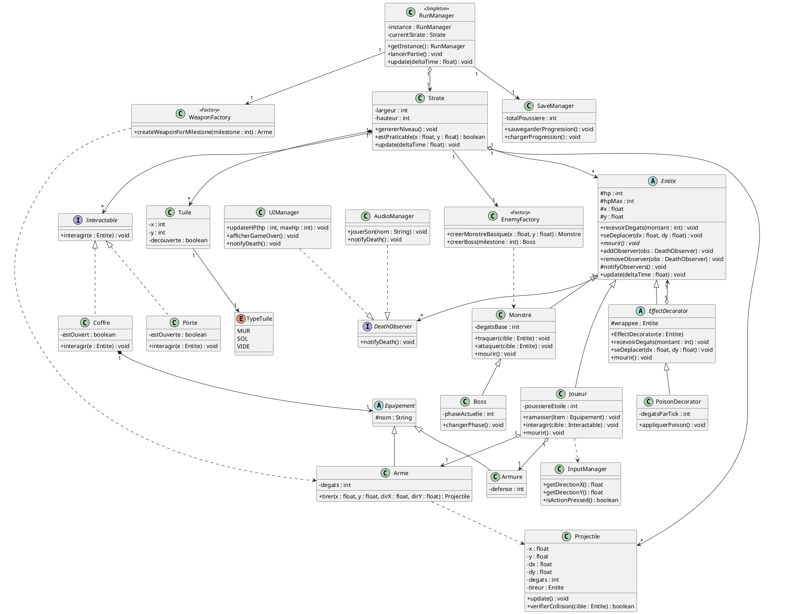

# Conception technique

> Ce document décrit l'architecture technique de votre projet. Vous êtes dans le rôle du lead-dev / architecte. C'est un document technique destiné à des développeurs.

## Vue d'ensemble

<!-- Décrivez les grandes briques de votre application et comment elles communiquent. Un schéma d'architecture est bienvenu. -->

## Design Patterns

DP 1 — Singleton

Feature associée : Gestionnaire de la session de jeu (RunManager ou GameStateService).

Justification : Dans un roguelike, de multiples systèmes transversaux (interface utilisateur, gestionnaire d'ennemis, apparition de coffres) nécessitent de connaître l'état de la partie (en jeu, dans les menus, ou en écran de mort). De plus, la récolte de "Poussière d'étoiles" (la monnaie de méta-progression) requiert un suivi continu et sécurisé. Une multiplicité d'instances du gestionnaire de partie risquerait d'entraîner des duplications de monnaie ou des états asynchrones critiques. Le Singleton est donc utilisé pour garantir une source de vérité unique et globale pour la session (la "Run") en cours.

Intégration : La classe RunManager est conçue pour n'être instanciée qu'une seule fois (via une annotation @Singleton ou une méthode getInstance()). Elle centralise les données globales du jeu telles que la Strate actuelle, la Poussière d'étoiles accumulée et l'état vital de l'Anomalie. L'ensemble des services périphériques y fait appel pour vérifier l'état du jeu avant toute exécution de logique.

DP 2 — Observer

Feature associée : Réaction en chaîne à l'effondrement de la session (Mort de l'Anomalie).

Justification : Lorsque les points de vie de l'Anomalie tombent à zéro, un événement critique est déclenché, nécessitant la réaction immédiate et simultanée de nombreux composants : affichage de l'écran de Game Over par l'UI, destruction du niveau généré procéduralement, déclenchement de la sauvegarde de la progression, et interruption de la boucle musicale. Coupler directement la classe du joueur à tous ces services créerait une architecture monolithique et fragile. Le pattern Observer résout ce problème en permettant à l'entité de notifier son état sans se soucier de qui l'écoute, assurant un couplage faible.

Intégration : La classe gérant l'Anomalie maintient une liste d'observateurs implémentant l'interface DeathObserver. Des composants indépendants comme MenuUI, AudioService et LevelGenerator s'y abonnent. Dès que la condition de mort (HP <= 0) est vérifiée, une méthode notifyDeath() est appelée pour boucler sur les observateurs et déclencher leurs processus respectifs de manière autonome.

DP 3 — Décorateur

Feature associée : Gestion dynamique des altérations d'état (Poison, Brûlure, Étourdissement).

Justification : Le système de combat inclut plusieurs altérations d'état applicables tant aux monstres qu'au joueur. Gérer ces effets via une structure conditionnelle complexe (if/else ou switch) au sein de la méthode update() des entités rendrait l'ajout de nouveaux effets lourd et sujet aux régressions (violation du principe Ouvert/Fermé). Le pattern Décorateur permet d'envelopper dynamiquement les entités avec ces altérations pour cumuler les comportements.

Intégration : L'architecture définit une interface commune IEntity (ou une classe abstraite de base) pour les combattants. Chaque altération d'état est modélisée par une classe décoratrice (PoisonDecorator, BurnDecorator) qui implémente IEntity et encapsule une référence vers l'entité qu'elle décore. Lorsqu'un équipement applique une brûlure, le système "enveloppe" l'entité cible avec une instance de BurnDecorator (target = new BurnDecorator(target)). Lors de la boucle de jeu, les appels aux méthodes de l'entité traversent séquentiellement chaque couche de décoration, appliquant les effets (dégâts, ralentissement) avant de relayer l'appel à l'entité de base encapsulée.

DP 4 — Factory

Feature associée : Instanciation du catalogue d'équipements du Hub et distribution contrôlée des armes scriptées.

Justification : Bien que la liste des équipements et armes soit fixe (non procédurale), leur instanciation reste complexe. Un équipement possède des métadonnées (nom, statistiques de base, coût en monnaie) et, potentiellement, une stratégie d'altération d'état associée (DP 3). Le code de l'interface du magasin ou du gestionnaire de niveau n'a pas à connaître cette logique de construction. Le pattern Factory est utilisé comme point d'assemblage centralisé, garantissant que la "recette" de chaque objet est respectée et évitant la dispersion des données chiffrées (hardcoding) dans divers fichiers.

Intégration : Le système utilise des classes de fabrication dédiées, telles que EquipmentFactory pour la gestion des objets du hub et WeaponFactory pour la progression en jeu. Par exemple, lorsque le joueur valide la Strate 3, le RunManager délègue à la WeaponFactory la tâche de construire et de fournir l'arme correspondante à ce palier spécifique.

## Diagrammes UML

### Diagramme 1 — *Classe*



### Diagramme 2 — *Type*

```plantuml
@startuml

@enduml
```

