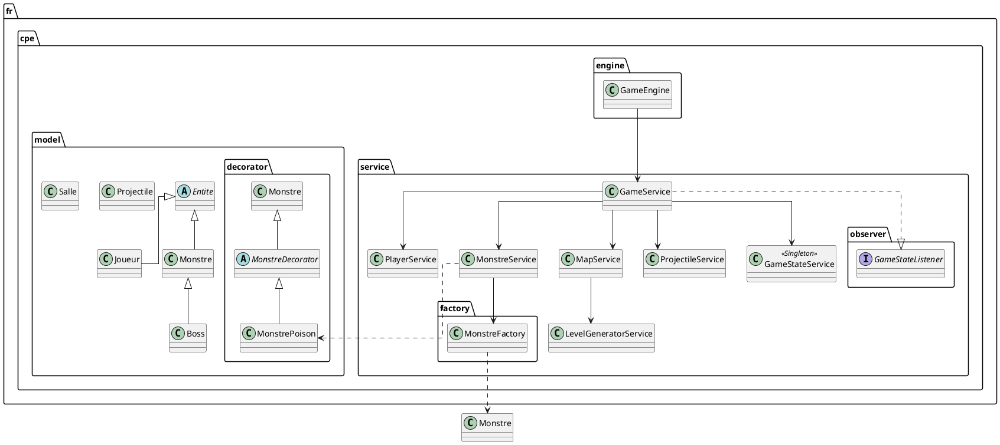

# Document de Réversibilité Technique - Black Holed

## État des Lieux Brut
Le projet actuel est une base de travail fonctionnelle mais très éloignée de la vision initiale décrite dans le document de conception. Il s'agit d'un prototype de combat en arène avec une navigation sommaire entre salles.

## Architecture Réelle vs Théorique

### Ce qui est implémenté
- **Moteur de Jeu** : Basé sur JavaFX avec un `AnimationTimer` à 60 FPS via `GameEngine`.
- **Système de Salles** : Une grille 5x5 générée aléatoirement (`LevelGeneratorService`) mais dont la structure est extrêmement simple (chemins linéaires + impasses).
- **Combat** : Système de projectiles basique et gestion de collision par distance.
- **Design Patterns** :
    - **Factory** : `MonstreFactory` gère l'instanciation des monstres de base, du boss et des monstres véloces.
    - **Decorator** : `MonstrePoison` enveloppe `Monstre` pour ajouter des dégâts sur le temps. C'est le seul effet d'état implémenté.
    - **Observer** : `GameStateService` notifie le `GameService` des changements d'état (Victoire/Défaite).
    - **Singleton** : Utilisation de Guice pour injecter les services en tant que singletons.

### Ce qui est absent (Code Mort ou Manquant)
- **Génération Procédurale** : Bien que présente, elle se limite à la connexion de salles identiques visuellement. Il n'y a pas de génération de contenu interne aux salles.
- **Système d'Équipement** : Aucune classe `Arme`, `Armure` ou `Equipement` n'existe dans le répertoire `model`.
- **Méta-progression** : La `poussiereEtoile` est présente dans le modèle `Joueur` mais aucune mécanique ne permet de la dépenser ou de la sauvegarder.
- **SaveManager** : Totalement absent. Aucune persistence des données n'est implémentée.
- **Interactables** : Pas de coffres, pas d'objets au sol.

## Architecture Actuelle (PlantUML)

## Points de Vigilance et "Dette Technique"
- **SaveManager Fantôme** : Le `SaveManager` cité dans la conception n'existe pas. Il est inutile en l'état car il n'y a aucune donnée persistante à sauvegarder (pas de stats permanentes).
- **Hardcoding des Assets** : Les chemins d'images et les dimensions des sprites sont codés en dur dans les services (`MonstreService`, `PlayerService`).
- **Gestion des Collisions** : La détection de collision est basée sur des calculs de distance euclidienne simplistes dans `PlayerService`, ce qui peut entraîner des imprécisions avec des sprites de tailles variées.
- **Patterns Incomplets** : Le pattern Decorator est présent mais son utilité est marginale vu qu'un seul effet existe.

## Recommandations pour la Reprise
1. **Implémenter la Persistance** : Créer un `SaveManager` utilisant JSON (Jackson ou Gson) pour sauvegarder la `poussiereEtoile`.
2. **Abstraire le Rendu** : Sortir la logique de création de `ImageView` des services pour la placer dans des classes de vue dédiées.
3. **Système d'Équipement** : Créer une interface `IEquipement` et l'intégrer au `Joueur` pour réellement utiliser le pattern Factory prévu initialement.
4. **Enrichir la Génération** : Passer de la simple grille de salles à une génération de contenu (murs internes, obstacles) dans `LevelGeneratorService`.
